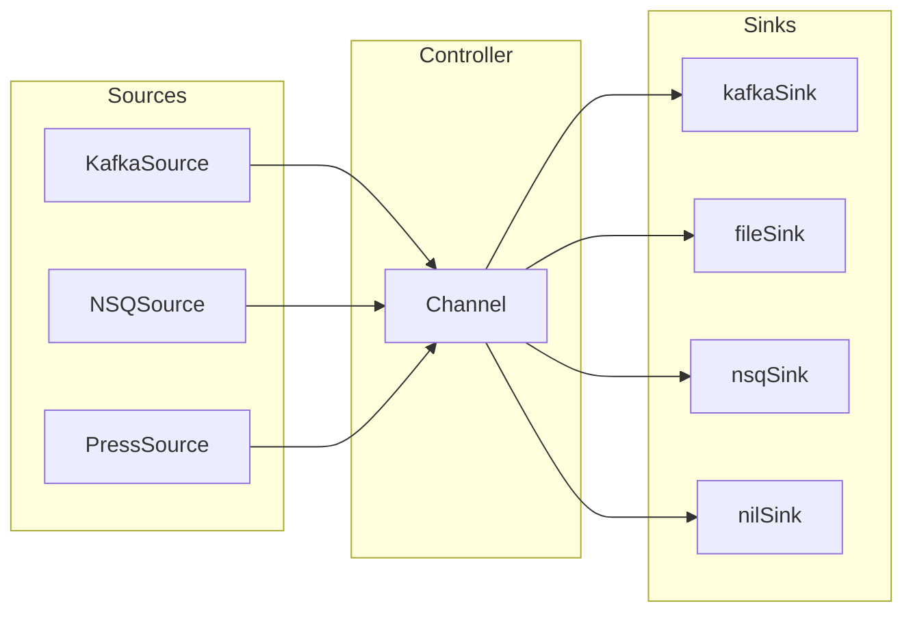
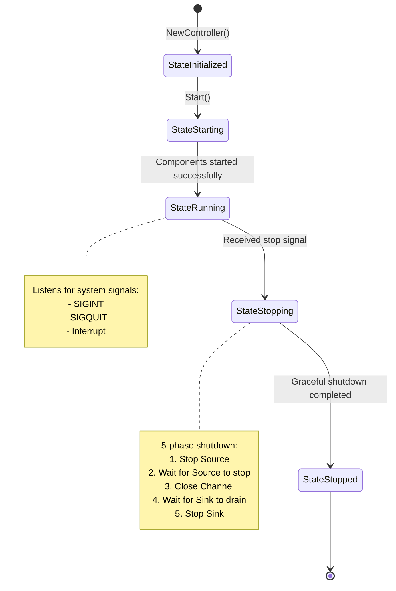
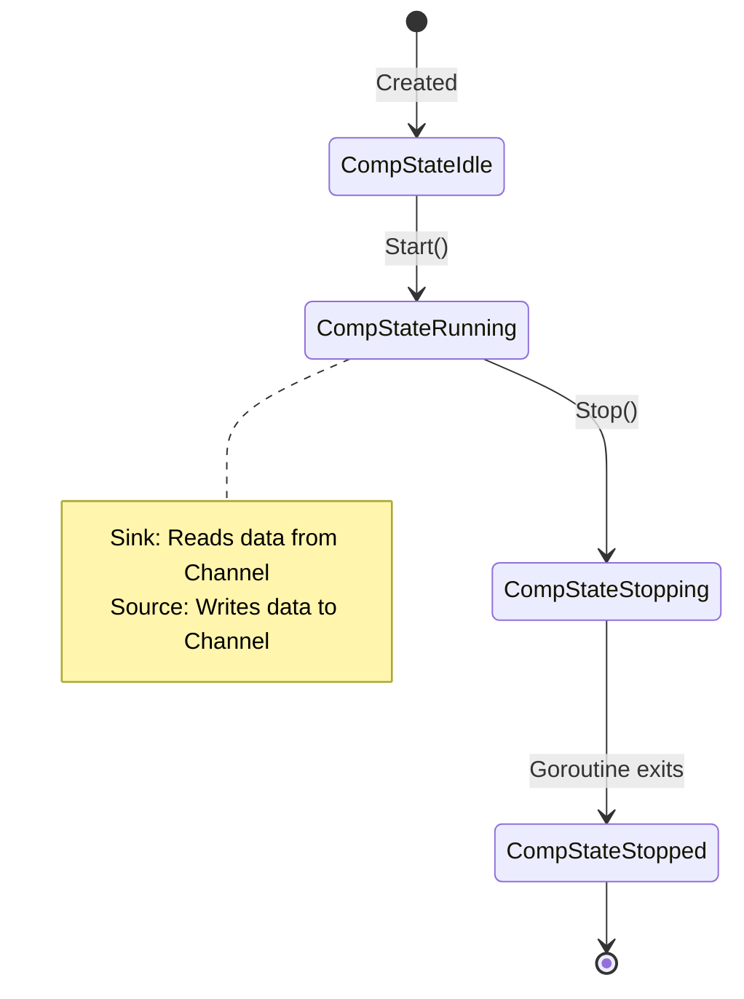
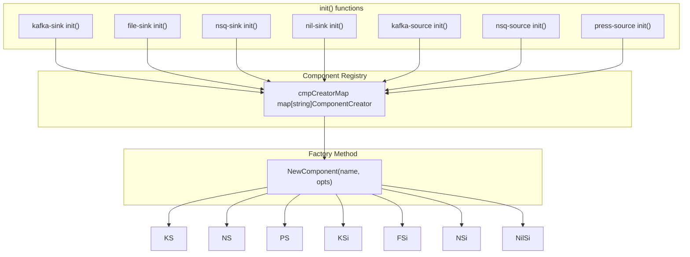

# Dior Architecture Documentation

## Project Overview

Dior is a data transmission tool that supports data transfer from multiple sources (Kafka, NSQ, Press) to multiple destinations (Kafka, NSQ, File).

## Core Class Diagram

```mermaid
classDiagram
    %% Core interfaces
    class Component {
        <<interface>>
        +Init(channel chan []byte) error
        +Start(ctx context.Context)
        +Stop()
    }
    
    class Controllable {
        <<interface>>
        +UnderControl(control *sync.WaitGroup)
    }
    
    %% Controller
    class Controller {
        -source Component
        -sink Component
        -sysSig chan os.Signal
        -srcWG *sync.WaitGroup
        -sinkWG *sync.WaitGroup
        -channel chan []byte
        -state State
        -stateMu sync.RWMutex
        -cancel context.CancelFunc
        -stopTimeout time.Duration
        +NewController() *Controller
        +AddComponents(opts *option.Options) error
        +Init() error
        +Start()
        +Stop()
        +GetState() State
        +SetStopTimeout(timeout time.Duration)
        -gracefulShutdown()
    }
    
    %% Asynchronizer
    class Asynchronizer {
        -control *sync.WaitGroup
        +Channel chan []byte
        +Output OutputFunc
        -state atomic.Int32
        -onError ErrorHandler
        -processedCount atomic.Int64
        -errorCount atomic.Int64
        +Init(channel chan []byte)
        +UnderControl(control *sync.WaitGroup)
        +Start(ctx context.Context)
        +Stop()
        +GetState() ComponentState
        +GetStats() (processed, errors int64)
        +SetErrorHandler(handler ErrorHandler)
        -work(ctx context.Context)
        -processData(data []byte)
        -drainChannel()
    }
    
    %% Source components
    class KafkaSource {
        -consumer *kafka.Consumer
        -client sarama.ConsumerGroup
        -kafkaBootstrapServers []string
        -topic string
        -group string
        -cancel context.CancelFunc
        +Init(channel chan []byte) error
        +Start(ctx context.Context)
        +Stop()
        -consume(msg *sarama.ConsumerMessage)
    }
    
    class NSQSource {
        -consumer *nsq.Consumer
        -nsqds []string
        -nsqLookupds []string
        -topic string
        -channel string
        +Init(channel chan []byte) error
        +Start(ctx context.Context)
        +Stop()
        -handlerFunc(message *nsq.Message) error
    }
    
    class PressSource {
        -cache *cache.Cache
        -dataFile string
        -writeDone chan int64
        -writeCmd chan int64
        -speed int64
        +Init(channel chan []byte) error
        +Start(ctx context.Context)
        +Stop()
        -generate(ctx context.Context)
        -doSend(ctx context.Context)
        -writeLoop(ctx context.Context, limit int64, ticket *cache.Ticket) (count int64, err error)
    }
    
    %% Sink components
    class kafkaSink {
        -producer sarama.SyncProducer
        -kafkaBootstrapServers []string
        -topic string
        +Init(channel chan []byte) error
        +Start(ctx context.Context)
        +Stop()
        -produce(data []byte)
    }
    
    class fileSink {
        -fileName string
        -file *os.File
        -writer *bufio.Writer
        -splitter []byte
        -bufSize int
        -processedCount atomic.Int64
        +Init(channel chan []byte) error
        +Start(ctx context.Context)
        +Stop()
        -output(data []byte)
    }
    
    class nsqSink {
        -producers []*nsq.Producer
        -topic string
        -nsqdTCPAddresses []string
        -nsqdLen int
        -nsqdIndex atomic.Int64
        +Init(channel chan []byte) error
        +Start(ctx context.Context)
        +Stop()
        -output(data []byte)
    }
    
    class nilSink {
        +Init(channel chan []byte) error
        +Start(ctx context.Context)
        +Stop()
        -output(data []byte)
    }
    
    %% Auxiliary types
    class kafka_Consumer {
        <<internal/kafka>>
        -ready chan bool
        -consume ConsumeFunc
        +Prepare(fun ConsumeFunc)
        +ResetReady()
        +WaitReady(ctx context.Context)
        +Setup(sarama.ConsumerGroupSession) error
        +Cleanup(sarama.ConsumerGroupSession) error
        +ConsumeClaim(session sarama.ConsumerGroupSession, claim sarama.ConsumerGroupClaim) error
    }
    
    %% Relationships
    Controllable <|-- Component
    Component <|.. Controller : not implemented
    Component <|.. KafkaSource
    Component <|.. NSQSource
    Component <|.. PressSource
    Component <|.. kafkaSink
    Component <|.. fileSink
    Component <|.. nsqSink
    Component <|.. nilSink
    
    Asynchronizer *-- Component : composition
    KafkaSource --|> Asynchronizer : inheritance
    NSQSource --|> Asynchronizer : inheritance
    PressSource --|> Asynchronizer : inheritance
    kafkaSink --|> Asynchronizer : inheritance
    fileSink --|> Asynchronizer : inheritance
    nsqSink --|> Asynchronizer : inheritance
    nilSink --|> Asynchronizer : inheritance
    
    Controller o-- Component : source
    Controller o-- Component : sink
    Controller *-- sync.WaitGroup : srcWG
    Controller *-- sync.WaitGroup : sinkWG
    
    KafkaSource o-- kafka_Consumer : consumer
```



## Data Flow Diagram



## Lifecycle State Diagram



## Component State Diagram



## Interface Definitions

### Component Interface

```go
type Component interface {
    Controllable
    Init(channel chan []byte) (err error)
    Start(ctx context.Context)
    Stop()
}
```

### Controllable Interface

```go
type Controllable interface {
    UnderControl(control *sync.WaitGroup)
}
```

### OutputFunc Type

```go
type OutputFunc func(data []byte)
```

## Component Registration Mechanism



## Directory Structure

```
dior/
├── cmd/
│   ├── dior/           # Main application entry point
│   │   └── main.go
│   ├── kafka-consumer/ # Kafka consumer utility
│   │   └── main.go
│   └── some/           # Other utilities
│       └── main.go
├── component/          # Core components
│   ├── component.go    # Interface definitions and factory methods
│   ├── controller.go   # Controller
│   └── async.go        # Asynchronous processing base class
├── internal/
│   ├── cache/          # Caching module
│   ├── kafka/          # Kafka consumer wrapper
│   ├── lg/             # Logging module
│   ├── sink/           # Sink implementations
│   │   ├── file.go
│   │   ├── kafka.go
│   │   ├── nsq.go
│   │   └── nil.go
│   ├── source/         # Source implementations
│   │   ├── kafka.go
│   │   ├── nsq.go
│   │   └── press.go
│   └── version/        # Version information
├── option/             # Configuration options
│   ├── option.go
│   ├── env.go
│   └── validate.go
└── docs/
    └── architecture.md # This document
```

## Design Patterns

### 1. Factory Pattern
- [`NewComponent()`](component/component.go:32) creates component instances by name
- [`RegCmpCreator()`](component/component.go:23) registers component creators

### 2. Composite Pattern
- `Asynchronizer` is composed by all Source and Sink components
- Provides common asynchronous processing capabilities

### 3. Template Method Pattern
- `Asynchronizer.work()` defines the processing flow for Sinks
- Subclasses customize specific behavior by setting the `Output` function

### 4. State Pattern
- `Controller` uses `State` to manage lifecycle
- `Asynchronizer` uses `ComponentState` to manage component state

## Key Design Decisions

### 1. Context Usage Guidelines
- **Do not store `context.Context` in structs**
- Only store `context.CancelFunc` when necessary (e.g., KafkaSource, Controller)
- Pass context as a parameter to all methods

### 2. Graceful Shutdown Process
1. Call `cancel()` to cancel context
2. Call `source.Stop()` to stop production
3. Wait for Source goroutines to exit
4. Close Channel
5. Wait for Sink to drain data
6. Call `sink.Stop()` to release resources

### 3. Concurrency Safety
- Use `atomic.Int32/Int64` to manage state and counters
- Use `sync.RWMutex` to protect state access
- Use `sync.WaitGroup` to wait for goroutines to exit

### 4. Error Handling
- Panic recovery mechanism
- Error counting and statistics
- Configurable error handling callbacks