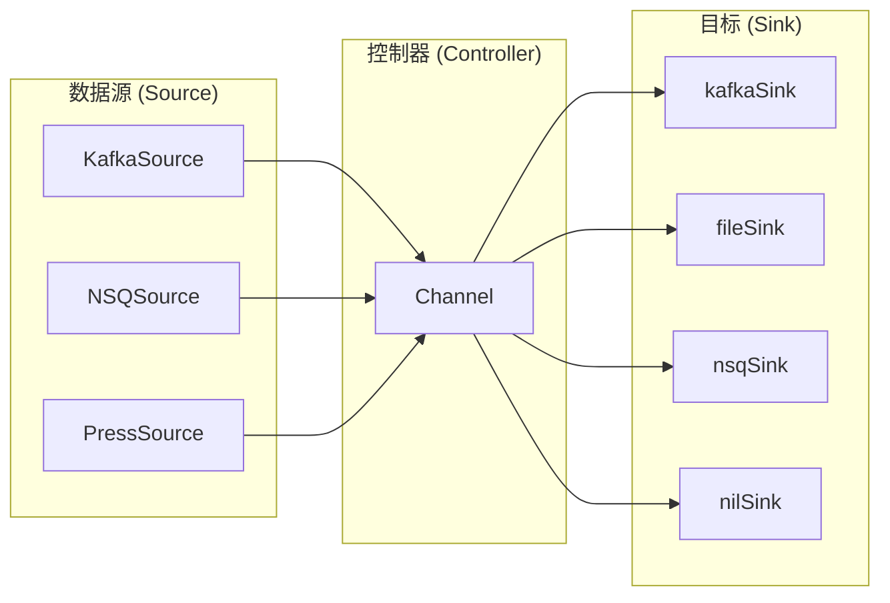
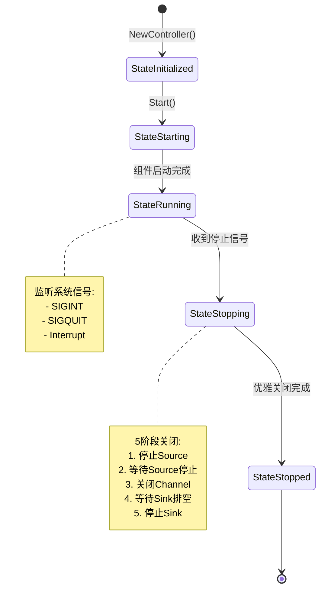
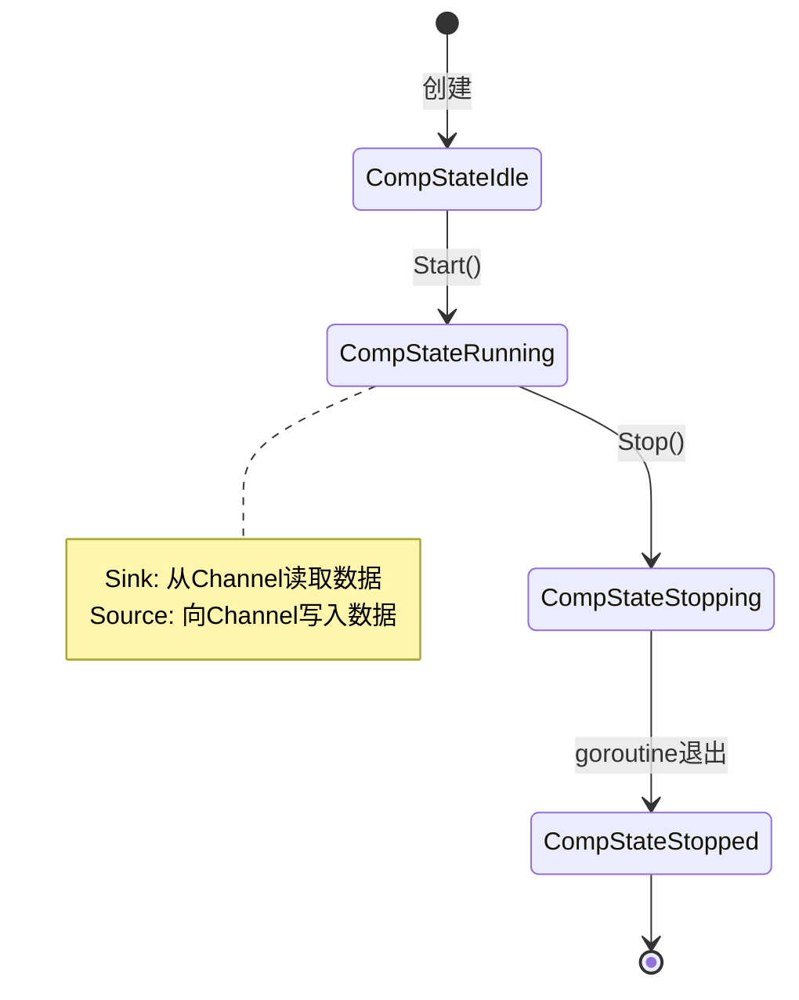

# Dior 项目架构文档

## 项目概述

Dior 是一个数据传输工具，支持多种数据源（Kafka、NSQ、Press）到多种目标（Kafka、NSQ、File）的数据传输。

## 核心类图

```mermaid
classDiagram
    %% 核心接口
    class Component {
        <<interface>>
        +Init(channel chan []byte) error
        +Start(ctx context.Context)
        +Stop()
    }
    
    class Controllable {
        <<interface>>
        +UnderControl(control *sync.WaitGroup)
    }
    
    %% Controller
    class Controller {
        -source Component
        -sink Component
        -sysSig chan os.Signal
        -srcWG *sync.WaitGroup
        -sinkWG *sync.WaitGroup
        -channel chan []byte
        -state State
        -stateMu sync.RWMutex
        -cancel context.CancelFunc
        -stopTimeout time.Duration
        +NewController() *Controller
        +AddComponents(opts *option.Options) error
        +Init() error
        +Start()
        +Stop()
        +GetState() State
        +SetStopTimeout(timeout time.Duration)
        -gracefulShutdown()
    }
    
    %% Asynchronizer
    class Asynchronizer {
        -control *sync.WaitGroup
        +Channel chan []byte
        +Output OutputFunc
        -state atomic.Int32
        -onError ErrorHandler
        -processedCount atomic.Int64
        -errorCount atomic.Int64
        +Init(channel chan []byte)
        +UnderControl(control *sync.WaitGroup)
        +Start(ctx context.Context)
        +Stop()
        +GetState() ComponentState
        +GetStats() (processed, errors int64)
        +SetErrorHandler(handler ErrorHandler)
        -work(ctx context.Context)
        -processData(data []byte)
        -drainChannel()
    }
    
    %% Source组件
    class KafkaSource {
        -consumer *kafka.Consumer
        -client sarama.ConsumerGroup
        -kafkaBootstrapServers []string
        -topic string
        -group string
        -cancel context.CancelFunc
        +Init(channel chan []byte) error
        +Start(ctx context.Context)
        +Stop()
        -consume(msg *sarama.ConsumerMessage)
    }
    
    class NSQSource {
        -consumer *nsq.Consumer
        -nsqds []string
        -nsqLookupds []string
        -topic string
        -channel string
        +Init(channel chan []byte) error
        +Start(ctx context.Context)
        +Stop()
        -handlerFunc(message *nsq.Message) error
    }
    
    class PressSource {
        -cache *cache.Cache
        -dataFile string
        -writeDone chan int64
        -writeCmd chan int64
        -speed int64
        +Init(channel chan []byte) error
        +Start(ctx context.Context)
        +Stop()
        -generate(ctx context.Context)
        -doSend(ctx context.Context)
        -writeLoop(ctx context.Context, limit int64, ticket *cache.Ticket) (count int64, err error)
    }
    
    %% Sink组件
    class kafkaSink {
        -producer sarama.SyncProducer
        -kafkaBootstrapServers []string
        -topic string
        +Init(channel chan []byte) error
        +Start(ctx context.Context)
        +Stop()
        -produce(data []byte)
    }
    
    class fileSink {
        -fileName string
        -file *os.File
        -writer *bufio.Writer
        -splitter []byte
        -bufSize int
        -processedCount atomic.Int64
        +Init(channel chan []byte) error
        +Start(ctx context.Context)
        +Stop()
        -output(data []byte)
    }
    
    class nsqSink {
        -producers []*nsq.Producer
        -topic string
        -nsqdTCPAddresses []string
        -nsqdLen int
        -nsqdIndex atomic.Int64
        +Init(channel chan []byte) error
        +Start(ctx context.Context)
        +Stop()
        -output(data []byte)
    }
    
    class nilSink {
        +Init(channel chan []byte) error
        +Start(ctx context.Context)
        +Stop()
        -output(data []byte)
    }
    
    %% 辅助类型
    class kafka_Consumer {
        <<internal/kafka>>
        -ready chan bool
        -consume ConsumeFunc
        +Prepare(fun ConsumeFunc)
        +ResetReady()
        +WaitReady(ctx context.Context)
        +Setup(sarama.ConsumerGroupSession) error
        +Cleanup(sarama.ConsumerGroupSession) error
        +ConsumeClaim(session sarama.ConsumerGroupSession, claim sarama.ConsumerGroupClaim) error
    }
    
    %% 关系
    Controllable <|-- Component
    Component <|.. Controller : 不实现
    Component <|.. KafkaSource
    Component <|.. NSQSource
    Component <|.. PressSource
    Component <|.. kafkaSink
    Component <|.. fileSink
    Component <|.. nsqSink
    Component <|.. nilSink
    
    Asynchronizer *-- Component : 组合关系
    KafkaSource --|> Asynchronizer : 继承
    NSQSource --|> Asynchronizer : 继承
    PressSource --|> Asynchronizer : 继承
    kafkaSink --|> Asynchronizer : 继承
    fileSink --|> Asynchronizer : 继承
    nsqSink --|> Asynchronizer : 继承
    nilSink --|> Asynchronizer : 继承
    
    Controller o-- Component : source
    Controller o-- Component : sink
    Controller *-- sync.WaitGroup : srcWG
    Controller *-- sync.WaitGroup : sinkWG
    
    KafkaSource o-- kafka_Consumer : consumer
```



## 数据流图



## 生命周期状态图



## 组件状态图



## 接口定义

### Component 接口

```go
type Component interface {
    Controllable
    Init(channel chan []byte) (err error)
    Start(ctx context.Context)
    Stop()
}
```

### Controllable 接口

```go
type Controllable interface {
    UnderControl(control *sync.WaitGroup)
}
```

### OutputFunc 类型

```go
type OutputFunc func(data []byte)
```

## 组件注册机制


## 目录结构

```
dior/
├── cmd/
│   ├── dior/           # 主程序入口
│   │   └── main.go
│   ├── kafka-consumer/ # Kafka消费者工具
│   │   └── main.go
│   └── some/           # 其他工具
│       └── main.go
├── component/          # 核心组件
│   ├── component.go    # 接口定义和工厂方法
│   ├── controller.go   # 控制器
│   └── async.go        # 异步处理基类
├── internal/
│   ├── cache/          # 缓存模块
│   ├── kafka/          # Kafka消费者封装
│   ├── lg/             # 日志模块
│   ├── sink/           # Sink实现
│   │   ├── file.go
│   │   ├── kafka.go
│   │   ├── nsq.go
│   │   └── nil.go
│   ├── source/         # Source实现
│   │   ├── kafka.go
│   │   ├── nsq.go
│   │   └── press.go
│   └── version/        # 版本信息
├── option/             # 配置选项
│   ├── option.go
│   ├── env.go
│   └── validate.go
└── docs/
    └── architecture.md # 本文档
```

## 设计模式

### 1. 工厂模式
- [`NewComponent()`](component/component.go:32) 根据名称创建组件实例
- [`RegCmpCreator()`](component/component.go:23) 注册组件创建器

### 2. 组合模式
- `Asynchronizer` 被所有Source和Sink组件组合
- 提供通用的异步处理能力

### 3. 模板方法模式
- `Asynchronizer.work()` 定义了Sink的处理流程
- 子类通过设置 `Output` 函数定制具体行为

### 4. 状态模式
- `Controller` 使用 `State` 管理生命周期
- `Asynchronizer` 使用 `ComponentState` 管理组件状态

## 关键设计决策

### 1. Context 使用规范
- **不在结构体中保存 `context.Context`**
- 只在必要时保存 `context.CancelFunc`（如 KafkaSource、Controller）
- 所有方法通过参数传递 context

### 2. 优雅关闭流程
1. 调用 `cancel()` 取消 context
2. 调用 `source.Stop()` 停止生产
3. 等待 Source goroutines 退出
4. 关闭 Channel
5. 等待 Sink 排空数据
6. 调用 `sink.Stop()` 释放资源

### 3. 并发安全
- 使用 `atomic.Int32/Int64` 管理状态和计数器
- 使用 `sync.RWMutex` 保护状态访问
- 使用 `sync.WaitGroup` 等待 goroutines 退出

### 4. 错误处理
- panic 恢复机制
- 错误计数统计
- 可配置的错误处理回调