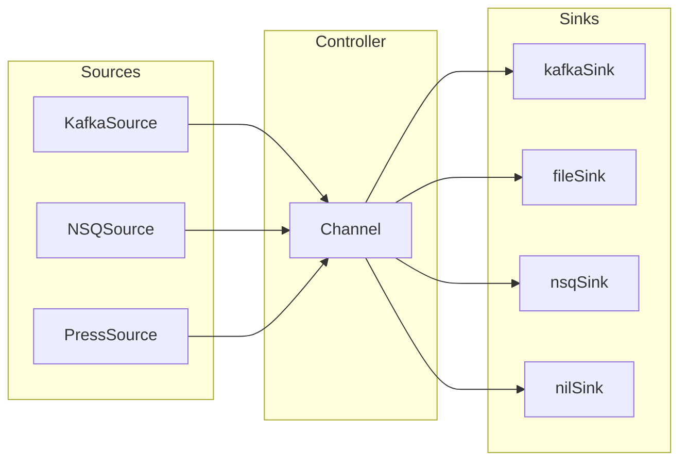
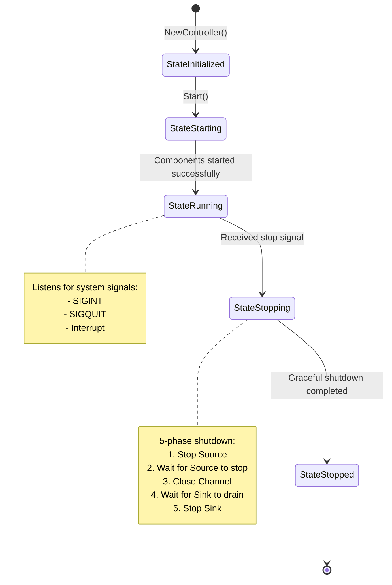
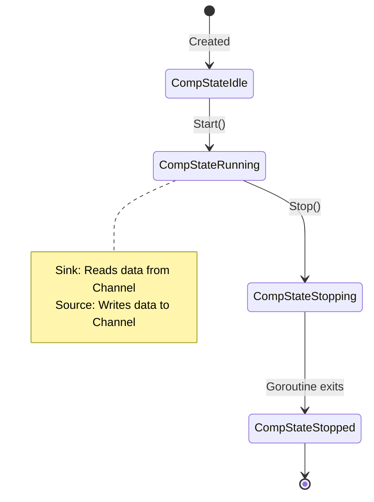
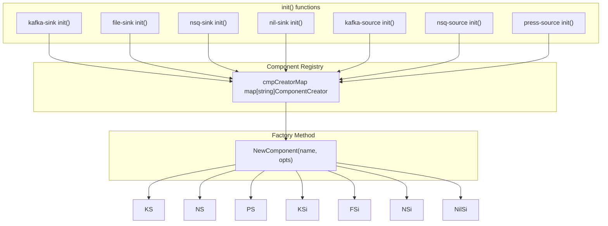

# Dior Architecture Documentation

## Project Overview

Dior is a data transmission tool that supports data transfer from multiple sources (Kafka, NSQ, Press) to multiple destinations (Kafka, NSQ, File).

## Core Class Diagram

```mermaid
classDiagram
    %% Core interfaces
    class Component {
        <<interface>>
        +Init(channel chan []byte) error
        +Start(ctx context.Context)
        +Stop()
    }
    
    class Controllable {
        <<interface>>
        +UnderControl(control *sync.WaitGroup)
    }
    
    %% Controller
    class Controller {
        -source Component
        -sink Component
        -sysSig chan os.Signal
        -srcWG *sync.WaitGroup
        -sinkWG *sync.WaitGroup
        -channel chan []byte
        -state State
        -stateMu sync.RWMutex
        -cancel context.CancelFunc
        -stopTimeout time.Duration
        +NewController() *Controller
        +AddComponents(opts *option.Options) error
        +Init() error
        +Start()
        +Stop()
        +GetState() State
        +SetStopTimeout(timeout time.Duration)
        -gracefulShutdown()
    }
    
    %% Asynchronizer
    class Asynchronizer {
        -control *sync.WaitGroup
        +Channel chan []byte
        +Output OutputFunc
        -name string
        -state atomic.Int32
        -onError ErrorHandler
        -processedCount atomic.Int64
        -errorCount atomic.Int64
        +NewAsynchronizer(name string) *Asynchronizer
        +Init(channel chan []byte)
        +UnderControl(control *sync.WaitGroup)
        +Start(ctx context.Context)
        +Stop()
        +GetState() ComponentState
        +SetState(state ComponentState)
        +GetStats() (processed, errors int64)
        +AddProcessedCount(delta int64)
        +AddErrorCount(delta int64)
        +SetErrorHandler(handler ErrorHandler)
        +ShowStats()
        +Add(delta int)
        +Done()
        -work(ctx context.Context)
        -processData(data []byte)
        -drainChannel()
    }
    
    %% Source components
    class KafkaSource {
        *component.Asynchronizer
        -client sarama.ConsumerGroup
        -kafkaBootstrapServers []string
        -topic string
        -group string
        +Init(channel chan []byte) error
        +Start(ctx context.Context)
        +Stop()
        +Setup(sarama.ConsumerGroupSession) error
        +Cleanup(sarama.ConsumerGroupSession) error
        +ConsumeClaim(sarama.ConsumerGroupSession, sarama.ConsumerGroupClaim) error
        Note: Implements exponential backoff retry with max 10 consecutive errors
    }
    
    class NSQSource {
        *component.Asynchronizer
        -consumer *nsq.Consumer
        -nsqds []string
        -nsqLookupds []string
        -topic string
        -channel string
        +Init(channel chan []byte) error
        +Start(ctx context.Context)
        +Stop()
        -handlerFunc(message *nsq.Message) error
    }
    
    class PressSource {
        *component.Asynchronizer
        -cache *cache.Cache
        -dataFile string
        -writeDone chan int64
        -writeCmd chan int64
        -speed int64
        +Init(channel chan []byte) error
        +Start(ctx context.Context)
        +Stop()
        -doCmd(ctx context.Context)
        -doSend(ctx context.Context)
        -writeLoop(ctx context.Context, limit int64, ticket *cache.Ticket) (count int64, err error)
        Note: Custom Start() implementation with dual goroutines (doCmd + doSend)
    }
    
    %% Sink components
    class kafkaSink {
        *component.Asynchronizer
        -producer sarama.SyncProducer
        -kafkaBootstrapServers []string
        -topic string
        +Init(channel chan []byte) error
        +Start(ctx context.Context)
        +Stop()
        -produce(data []byte) error
        Note: Implements retry mechanism with max 3 attempts and exponential backoff
    }
    
    class fileSink {
        *component.Asynchronizer
        -fileName string
        -file *os.File
        -writer *bufio.Writer
        -splitter []byte
        -bufSize int
        -processedCount atomic.Int64
        +Init(channel chan []byte) error
        +Start(ctx context.Context)
        +Stop()
        -output(data []byte) error
        Note: Flushes buffer every 100 records to balance performance and memory
    }
    
    class nsqSink {
        *component.Asynchronizer
        -producers []*nsq.Producer
        -topic string
        -nsqdTCPAddresses []string
        -nsqdLen int
        -nsqdIndex atomic.Int64
        +Init(channel chan []byte) error
        +Start(ctx context.Context)
        +Stop()
        -output(data []byte) error
        Note: Implements round-robin load balancing across multiple NSQD instances
    }
    
    class nilSink {
        *component.Asynchronizer
        +Init(channel chan []byte) error
        +Start(ctx context.Context)
        +Stop()
        -output(data []byte) error
    }
    
    %% Relationships
    Controllable <|-- Component
    Component <|.. Controller : not implemented
    Component <|.. KafkaSource
    Component <|.. NSQSource
    Component <|.. PressSource
    Component <|.. kafkaSink
    Component <|.. fileSink
    Component <|.. nsqSink
    Component <|.. nilSink
    
    Asynchronizer *-- Component : composition
    KafkaSource *-- Asynchronizer : embedded
    NSQSource *-- Asynchronizer : embedded
    PressSource *-- Asynchronizer : embedded
    kafkaSink *-- Asynchronizer : embedded
    fileSink *-- Asynchronizer : embedded
    nsqSink *-- Asynchronizer : embedded
    nilSink *-- Asynchronizer : embedded
    
    Controller o-- Component : source
    Controller o-- Component : sink
    Controller *-- sync.WaitGroup : srcWG
    Controller *-- sync.WaitGroup : sinkWG
```



## Data Flow Diagram



## Lifecycle State Diagram



## Component State Diagram



## Interface Definitions

### Component Interface

```go
type Component interface {
    Controllable
    Init(channel chan []byte) (err error)
    Start(ctx context.Context)
    Stop()
}
```

### Controllable Interface

```go
type Controllable interface {
    UnderControl(control *sync.WaitGroup)
}
```

### OutputFunc Type

```go
type OutputFunc func(data []byte) error
```

## Component Registration Mechanism



## Directory Structure

```
dior/
├── cmd/
│   ├── dior/           # Main application entry point
│   │   └── main.go
│   └── some/           # Other utilities
│       └── main.go
├── component/          # Core components
│   ├── component.go    # Interface definitions and factory methods
│   ├── controller.go   # Controller
│   └── async.go        # Asynchronous processing base class
├── internal/
│   ├── cache/          # Caching module
│   │   └── cache.go
│   │   └── cache_test.go
│   ├── lg/             # Logging module
│   │   ├── appender.go
│   │   ├── level.go
│   │   ├── logger.go
│   │   └── std.go
│   ├── sink/           # Sink implementations
│   │   ├── file.go
│   │   ├── file_test.go
│   │   ├── kafka.go
│   │   ├── nsq.go
│   │   └── nil.go
│   ├── source/         # Source implementations
│   │   ├── kafka.go
│   │   ├── nsq.go
│   │   ├── press.go
│   │   ├── press_test.go
│   │   └── nsq.go
│   └── version/        # Version information
│       └── binary.go
├── option/             # Configuration options
│   ├── option.go
│   ├── env.go
│   └── validate.go
│   └── validate_test.go
└── docs/
    └── architecture.md # This document
```

## Design Patterns

### 1. Factory Pattern
- [`NewComponent()`](component/component.go:32) creates component instances by name
- [`RegCmpCreator()`](component/component.go:23) registers component creators

### 2. Composition Pattern
- `Asynchronizer` is embedded in all Source and Sink components
- Provides common asynchronous processing capabilities through struct embedding

### 3. Template Method Pattern
- `Asynchronizer.work()` defines the processing flow for Sinks
- Subclasses customize specific behavior by setting the `Output` function
- Source components can override `Start()` method for custom behavior (e.g., PressSource)

### 4. State Pattern
- `Controller` uses `State` to manage lifecycle
- `Asynchronizer` uses `ComponentState` to manage component state

## Key Design Decisions

### 1. Context Usage Guidelines
- **Do not store `context.Context` in structs**
- Only store `context.CancelFunc` when necessary (e.g., KafkaSource, Controller)
- Pass context as a parameter to all methods

### 2. Graceful Shutdown Process
1. Call `cancel()` to cancel context
2. Call `source.Stop()` to stop production (with timeout support)
3. Wait for Source goroutines to exit (with timeout support)
4. Close Channel
5. Wait for Sink to drain data (with timeout support)
6. Call `sink.Stop()` to release resources (with timeout support)

### 3. Concurrency Safety
- Use `atomic.Int32/Int64` to manage state and counters
- Use `sync.RWMutex` to protect state access
- Use `sync.WaitGroup` to wait for goroutines to exit

### 4. Error Handling
- Panic recovery mechanism in `Asynchronizer.work()` and `processData()`
- Error counting and statistics via `atomic.Int64`
- Configurable error handling callbacks via `SetErrorHandler()`
- KafkaSource implements exponential backoff retry with max consecutive errors limit

### 5. Performance Optimizations
- **PressSource**: Uses buffered file reading with configurable buffer size
- **FileSink**: Uses buffered I/O with periodic flushes (every 100 records)
- **NSQSink**: Implements round-robin load balancing across multiple NSQD instances
- **KafkaSink**: Uses synchronous producer with retry mechanism
- **Channel**: Configurable buffer size to balance memory usage and throughput

### 6. Configuration Management
- **Command-line flags**: Primary configuration interface
- **Environment variables**: Secondary configuration interface (lowercase with underscores)
- **Validation**: Comprehensive validation in `option.Validate()` with clear error messages
- **Defaults**: Reasonable defaults for all parameters

### 7. Logging Strategy
- **Structured logging**: Uses `internal/lg` package with consistent prefix
- **Log levels**: debug, info, warn, error, fatal
- **Performance**: Avoids expensive operations in hot paths (e.g., uses `Enable()` check before logging)
- **Error tracking**: Logs errors with context and counts them for statistics

### 8. Testing Strategy
- **Unit tests**: Comprehensive tests for all components
- **Integration tests**: Test component interactions
- **Race detection**: Tests run with `-race` flag
- **Coverage**: High test coverage (>90%) for core components

### 9. Build and Deployment
- **Cross-compilation**: Full support for multiple platforms and architectures
- **Static binaries**: CGO disabled for portability
- **Docker support**: Dockerfile included for containerized deployment
- **Makefile**: Comprehensive build system with clean, test, and install targets

### 10. Extensibility
- **New components**: Easy to add new Source/Sink types by implementing Component interface
- **Component registration**: Automatic registration via `init()` functions
- **Configuration**: New parameters can be added to `option.Options` with minimal changes